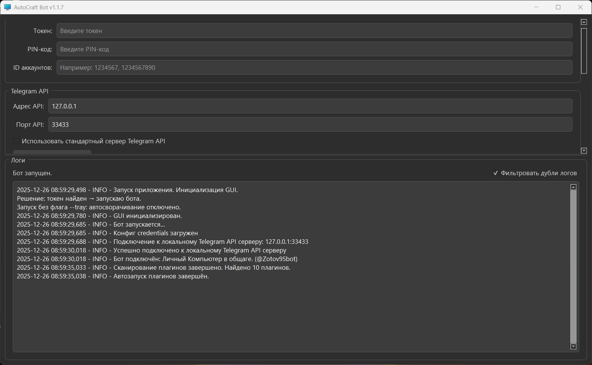
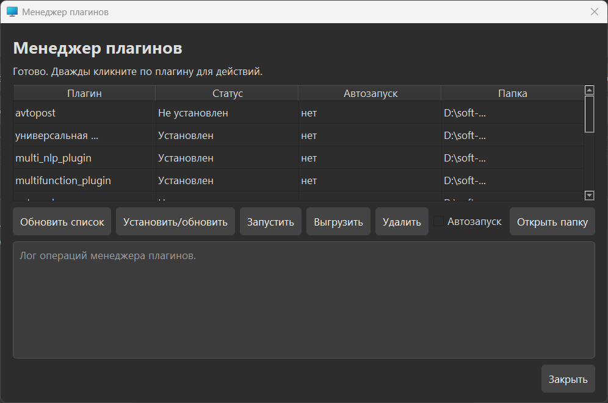
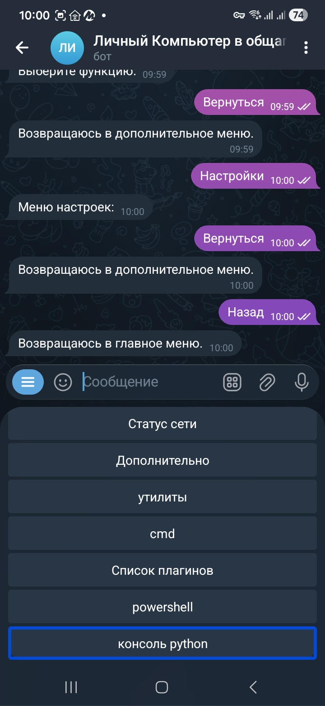
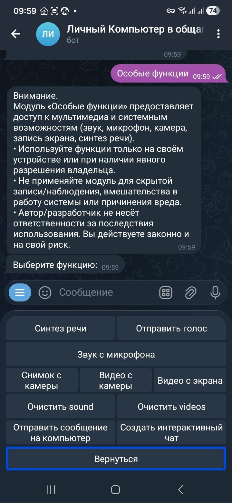

# AutoCraft Bot

**AutoCraft Bot 1.1.8** - программа для управления и мониторинга компьютера на **Windows**.  
Сейчас это не только Telegram-бот, но и **веб-панель** для удалённой работы с системой: мониторинг, управление, сервисные инструменты, роли пользователей и расширяемая архитектура.

Проект изначально делался с упором на удобство и практику: **кнопки вместо хаоса**, понятная навигация и нормальная работа со **скринридерами** (TalkBack/VoiceOver/NVDA).  
Веб-панель тоже делалась с учётом доступности. Её можно запускать **отдельно**, даже если Telegram-бот не используется.

> Проект рассчитан на простоту: можно запустить готовую сборку **EXE** (без установки Python) или работать из исходников.

---
## Что нового в версии 1.1.8: веб-панель

В версии **1.1.8** в AutoCraft Bot добавлена **веб-панель**. Это отдельный веб-интерфейс для управления и мониторинга Windows-компьютера, который можно использовать как вместе с Telegram-ботом, так и отдельно.

### Основные функции веб-панели

- **Мониторинг и аудит**: статусы, события, журналы, базовая диагностика и контроль работы системы.
- **Центр коммуникаций**: встроенные разделы **мессенджера**, **уведомлений** и коммуникационного центра.
- **Файловый менеджер**: работа с файлами и папками через веб-интерфейс.
- **Терминал**: выполнение команд в веб-панели.
- **Управление питанием**: выключение, перезагрузка и другие действия с питанием ПК.
- **Редактор реестра**: базовые операции с реестром Windows через интерфейс.
- **Диспетчер устройств**: просмотр и управление устройствами (по мере развития модуля).
- **Прямая трансляция с камер** (beta): поток с подключённых камер для системного анализа.
- **Удалённый рабочий стол** (beta): функция в разработке, может работать не на всех версиях Windows, дорабатывается.
- **Пользователи и роли**: можно добавлять пользователей и разграничивать доступ.
- **Расширения/плагины**: новые функции можно добавлять без правки основного кода, панель подхватывает их автоматически.
- **Запуск без Telegram-бота**: веб-панель можно поднять отдельно, если нужен только веб-доступ.

### Что ещё в работе

- В **Центре коммуникаций** запланированы **аудио- и видеозвонки** (после нормальной доработки SSL).
- Раздел **«Администрирование / Серверы»** подготовлен под управление несколькими ПК, сейчас это заготовка.
- **Температуры комплектующих** пока не включены в веб-панель, но эта функция уже в планах.

> Важно: веб-панель активно развивается, поэтому местами возможны баги и временные ограничения.

---

## Что умеет (коротко)

- ✅ **Веб-панель (1.1.8)**: отдельный web-интерфейс для управления и мониторинга Windows-компьютера.
- ✅ **Веб: мессенджер, уведомления, центр коммуникаций** (аудио/видеозвонки запланированы после доработки SSL).
- ✅ **Веб-инструменты**: файловый менеджер, терминал, редактор реестра, питание, диспетчер устройств.
- ✅ **Веб (beta)**: прямая трансляция с камер и удалённый рабочий стол (может работать не на всех Windows, модуль дорабатывается).
- ✅ **Роли и пользователи** в веб-панели: разграничение доступа и администрирование.
- ✅ **Веб-панель можно запускать отдельно** от Telegram-бота.


- ✅ **Дополнительно → Громкость**: выбор устройства воспроизведения + изменение громкости прямо из Telegram.
- ✅ **Заметки**: быстрые заметки из Telegram (хранятся в `notes/` в `.txt`).
- ✅ **Главное меню бота** с кнопками (настраивается, можно прятать/показывать пункты).
- ✅ **Список плагинов** и **менеджер плагинов**: установка/обновление/удаление, автозапуск, резервные копии.
- ✅ **Утилиты** (разделы): файловый менеджер, службы Windows, BAT‑скрипты, сеть, управление браузером и др.
- ✅ **Диагностика окружения**: тесты, сбор информации и проверка устойчивости (полезно разработчику).
- ✅ **Статус сервера**: ОС/CPU/RAM/диски — быстрый мониторинг.
- ✅ **Питание**: выключение/перезагрузка/сон/гибернация/выход из системы.
- ✅ **Отправка/приём файлов** через Telegram.
- ✅ **Особые функции**: мультимедиа и системные возможности (камера/микрофон/запись экрана/синтез речи) с явным предупреждением о законном использовании.

---

## Скриншоты

> Скриншоты лежат в `docs/screenshots/` (имена уже “GitHub‑дружелюбные”).  
> Ниже самые важные, остальное смотрите в документации.

### GUI (Windows)





### Telegram‑бот





---

## Документация интерфейса

- **GUI (Windows):** [Описание интерфейса](docs/GUI_DESCRIPTION_RU.md)
- **Telegram‑бот:** [Меню и навигация](docs/TELEGRAM_UI_RU.md)

---

## Быстрый старт (готовый EXE)

Если вы используете готовую сборку **EXE**, то обычно всё просто:

1. Запустите `AutoCraft Bot.exe`.
2. Введите:
   - **Токен** Telegram‑бота
   - **PIN‑код** (для авторизации)
   - **ID аккаунтов** (разрешённые Telegram ID, через запятую)
3. При необходимости настройте Telegram API:
   - локальный API (например `127.0.0.1:33433`) или стандартный сервер.
4. Откройте чат с ботом в Telegram и пользуйтесь меню кнопками.

> В EXE‑режиме вы можете **добавлять/удалять плагины** (папка `plugins/`) **без перекомпиляции**.

---

## Как получить токен Telegram‑бота (BotFather)

1. Откройте в Telegram бота **@BotFather**.
2. Выполните команду `/newbot` и задайте имя/username.
3. BotFather выдаст **Bot Token** вида `123456:ABC...` — это и есть токен, который вводится в AutoCraft Bot.

Что обычно вводится в GUI:
- **Bot Token** — токен от BotFather.
- **PIN‑код** — ваш код авторизации (не сообщайте его посторонним).
- **Разрешённые Telegram ID** — список ID, кому разрешено управлять ПК (через запятую).

> Если не знаете свой Telegram ID: воспользуйтесь любым “ID‑ботом” в Telegram или посмотрите его в логах AutoCraft Bot при первом обращении.

## Данные для локального Telegram Bot API (опционально)

AutoCraft Bot может работать через локальный `telegram-bot-api` (это отдельный сервер, который крутится на вашем ПК). Это полезно, когда нужен локальный контур, стабильность и больше контроля.

Обычно нужны 3 типа данных:

1) **Bot Token** (из BotFather)  
   Токен **тот же самый**, что и для обычного режима. Локальный API не “заменяет” токен, он просто меняет маршрут запросов.

2) **Адрес локального API (base URL)**  
   Пример: `http://127.0.0.1:33433` (порт зависит от ваших настроек).

3) **API_ID и API_HASH** (для запуска локального `telegram-bot-api` сервера)  
   Берутся на сайте Telegram:
   - зайдите на `https://my.telegram.org`,
   - откройте раздел **API development tools**,
   - создайте приложение (любое имя/описание),
   - получите `api_id` и `api_hash`.

Где это настраивается:
- в GUI есть окно **`telegram-bot-api-server`** (Local Mode, порт, пути Data/Temp и т.д.)
- при включённом локальном режиме AutoCraft Bot начинает ходить в Telegram через этот локальный сервер.

- В EXE‑режиме папки **`serverapibot/`** и **`python/`** используются для локального API и разворачиваются автоматически при запуске .


## Установка из исходников (Python)

> Если у вас свой рабочий окружняк (VS Code/Python), можно запускать из исходников.

Примерно так:

1. Установите Python 3.11).
2. Установите зависимости
команды отдельно, сначала первую, потом вторую:
   ```bash

   pip install -r requirements.txt
потом 
   pip install -r requirements-web.txt
   ```
3. Запустите основной файл проекта  bot-ok.py

---

## Главная идея: всё через кнопки (доступно скринридерам)

AutoCraft Bot сделан так, чтобы в Telegram можно было работать “в потоке”:

- ReplyKeyboard: большие кнопки под полем ввода
- “Назад/Вернуться” в подменю
- Чёткие текстовые подсказки (скринридер нормально озвучивает контекст)
- Команда `/menu` возвращает в главное меню и (при необходимости) сбрасывает активные режимы

---

## Главное меню: настраиваемое

В боте есть настройка видимости пунктов главного меню:

- включить/выключить конкретные пункты (кнопки вида `Включить: ...` / `Выключить: ...`)
- изменения сохраняются в `config.ini`, секция:
  - `[mainmenu_visibility]`

### Ярлыки утилит в главном меню

“Утилиты” живут отдельным разделом, но их можно **закреплять как ярлыки** в главное меню.

Идея:
- если утилиты зарегистрированы в `utilities_registry`, их можно включить в настройке видимости, и они появятся на главной клавиатуре.

---

## Раздел «Утилиты»

В Telegram доступен раздел “утилиты” (категории инструментов). Примеры разделов:

- **Файловый менеджер** (полноценная работа с файлами через Telegram)
- **Работа со службами** (управление службами Windows)
- **Работа с BAT** (запуск и управление BAT‑сценариями/задачами)
- **Диагностика окружения**
- **Работа с сетью**
- **Управление браузером**


### Файловый менеджер (внутри «Утилит»)

В «Утилитах» есть **полноценный файловый менеджер**, который работает **полностью через кнопки** (ReplyKeyboard), без “пиши команды руками”.
По сути, это “проводник через Telegram”, но с нормальной навигацией:

- просмотр содержимого папок (вперёд/назад),
- быстрые действия над файлами и каталогами (скачать в Telegram, удалить, переименовать, создать папку и т.д.),
- удобная связка с папками `files/` и `infiles/` (см. ниже).

Это особенно полезно, когда нужно **быстро перекинуть файлы** или проверить, что на ПК происходит, не лезя в RDP и не открывая файловый проводник.

---

## Менеджер плагинов


## Меню «Дополнительно» (Telegram)

В Telegram у бота есть раздел **«Дополнительно»**. Это “карман” для сервисных штук, которые нужны постоянно:

- заметки (быстрый блокнот),
- отправка/приём файлов,
- питание (выключение/перезагрузка/сон и т.д.),
- связь с разработчиком,
- **громкость**: можно **выбрать устройство воспроизведения** и **поменять уровень громкости** (удобно, когда ПК стоит где-то “в другом мире”, а звук внезапно не туда ушёл).

---

## Менеджер плагинов

Перед тем как писать свой плагин, обязательно загляните в: **[`Strict instructions for writing plugins.`](docs/Strict%20instructions%20for%20writing%20plugins..md)**.

Менеджер плагинов есть:
- в **GUI** (Windows‑окно),
- и в **Telegram** (меню “Плагины”).

Типовые возможности:
- список плагинов,
- установка/обновление,
- запуск/выгрузка,
- удаление,
- **автозапуск**,
- **резервные копии** (бэкап/восстановление).

### Плагины без перекомпиляции (важно)

Если вы запускаете **EXE‑сборку**, то новые функции можно добавлять так:

1. Создать папку с плагином в `plugins/`.
2. Добавить код плагина (по шаблону проекта).
3. Перезапустить приложение или обновить список плагинов.

То есть **без правки исходников и без Nuitka** вы расширяете функциональность.

---

## Дополнение своими модулями (из исходников)

Если вы разрабатываете проект из исходников, можно добавить новый модуль/функцию:

- написать файл‑модуль по принятому в проекте формату (реестры/хэндлеры/точка входа),
- собрать EXE через Nuitka (или запустить напрямую Python).

> В проекте предусмотрена архитектура модулей/реестров, чтобы меню и функции собирались динамически.

---

## Локальный Telegram Bot API (опционально)


### Файлы больших размеров в локальном Telegram Bot API

Если вы используете **локальный `telegram-bot-api`**, AutoCraft Bot может работать с большими файлами: **вплоть до ~2 ГБ**.
На практике упирается в вашу файловую систему/диск и настройки сервера, но идея простая: **локальный контур = меньше “узких горлышек”** и больше контроля.
Проект умеет работать через локальный `telegram-bot-api` сервер (по скриншотам: `127.0.0.1:33433`). Это полезно, когда нужен локальный контур и больше контроля.

В GUI есть отдельное окно “telegram-bot-api-server” с:
- Local Mode,
- портом, путями Data/Temp,
- логами UI/API,
- автозапуском.

---

## Папки и файлы, которые создаёт программа (и зачем)

Некоторые папки создаются автоматически в процессе работы. Это нормально, они **нужны**.

Базовые:
- `config.ini` — настройки (в т.ч. видимость главного меню, режимы, дебаг и т.п.).
- `plugins/` — ваши плагины.
- `plugins_backup/` — резервные копии плагинов (создаётся менеджером плагинов).
- `files/` — сюда сохраняются файлы, которые вы отправляете боту (приём файлов).
- `infiles/` — файлы, которые бот может отправлять вам (отправка файлов).
- `log/` — логи работы (GUI/бот/модули).

Служебные (могут появляться в зависимости от модулей/режимов):
- `cache/`, `temp/` — временные данные и кэш.
- `__pycache__/` — кэш Python (если запускаете из исходников).

Папки для **локального Telegram Bot API** и менеджера плагинов (актуально для готовой EXE‑сборки):
- `serverapibot/` — компоненты локального `telegram-bot-api` (сервер, его данные/временные файлы, настройки).
- `python/` — поставляемый Python‑рантайм, который используется:
  - менеджером плагинов (служебные операции, установка/проверки и т.п.),
  - и вспомогательными действиями при локальном Telegram API.

> Всё это **разворачивается автоматически при запуске** (если вы используете готовую EXE‑сборку и включили нужные функции).  
> Удалять `python/` и `serverapibot/` не стоит, иначе локальный Telegram API и часть сервисных операций могут перестать работать.


### Дополнительные рабочие папки (создаются автоматически)

Помимо базовых каталогов, в процессе работы могут появляться и использоваться такие папки:

- `notes/` — **заметки** (обычные `.txt`), которые вы создаёте/читаете из меню “Дополнительно”.
- `screenshots/` — **скриншоты экрана** и **фото с камеры** (если используете соответствующие функции).
- `sound/` — **аудио**: записи с микрофона и/или результаты синтеза речи (TTS), в зависимости от включённых модулей.
- `videos/` — **видео**: запись экрана и/или видео с камеры.

> Эти папки создаются программой автоматически, руками их делать не обязательно.

### `config.ini` (важно)

`config.ini` — это центральная точка настроек.
Там хранятся **все параметры для работы**: режимы, включён ли debug, видимость пунктов главного меню, настройки локального Telegram API и т.д.

## Безопасность

AutoCraft Bot даёт доступ к управлению ПК, поэтому:

- **не публикуйте токен** бота в открытых местах,
- используйте **PIN** и список разрешённых **Telegram ID**,
- осторожно включайте “Особые функции” (камера/микрофон/экран),
- используйте функции только **на своём устройстве** или с явного разрешения владельца.

---

## Для разработчика: диагностика окружения

В проекте есть утилита “Диагностика окружения”:

- показывает важную информацию о среде,
- помогает тестировать EXE‑режим,
- содержит тестовые действия для проверки устойчивости (например имитация зависания/аварийного завершения).

---

## Структура документации

- `docs/GUI_DESCRIPTION_RU.md` — описание Windows‑GUI
- `docs/TELEGRAM_UI_RU.md` — описание интерфейса Telegram‑бота
- `docs/screenshots/` — скриншоты (GUI и Telegram)
- [`Strict instructions for writing plugins.`](docs/Strict%20instructions%20for%20writing%20plugins..md) — **строгая инструкция** по разработке плагинов (обязательно к прочтению перед началом)

---

## Частые вопросы

### Почему пункты меню отличаются?
Главное меню **настраиваемое**. Кроме того, пункты могут добавляться/убираться плагинами и утилитами.

### Можно ли расширять без перекомпиляции?
Да. В EXE‑режиме новые плагины добавляются в `plugins/` и подхватываются менеджером плагинов.

---

## Контакты / обратная связь

- Telegram (обратная связь): **@zotovsmol**
- Репозиторий: https://github.com/andreykadelite/AutoCraft-Bot  
- Связь с разработчиком доступна прямо из меню бота (раздел “Дополнительно”).

---

## Лицензия

Смотрите файл `LICENSE` в репозитории .